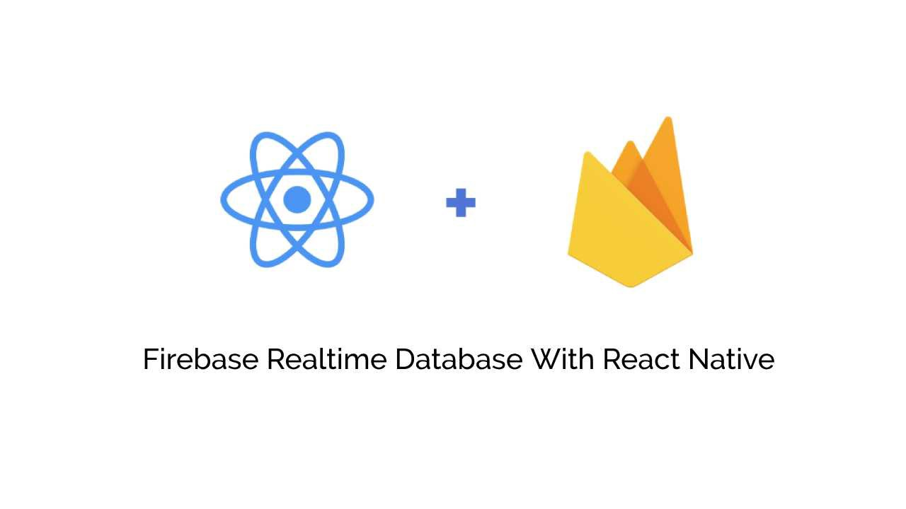
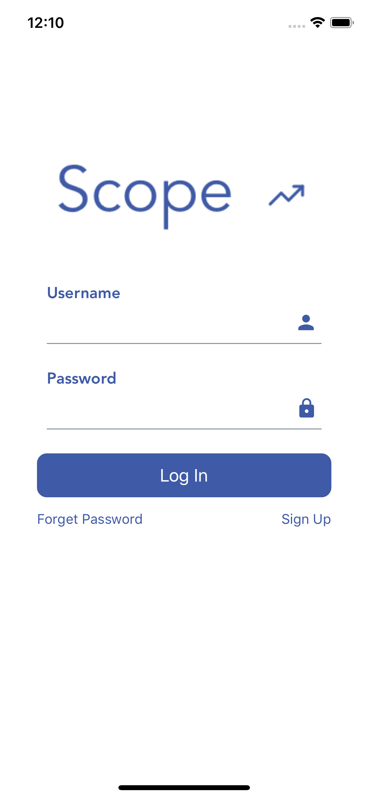
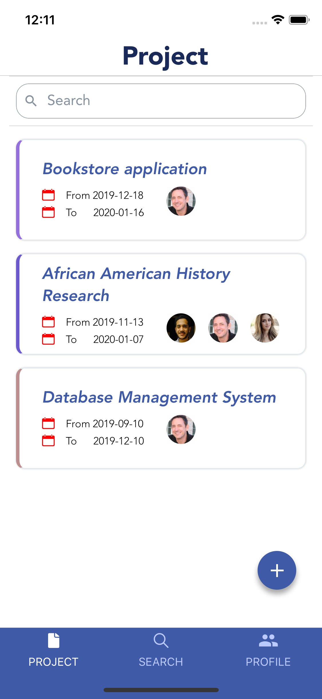
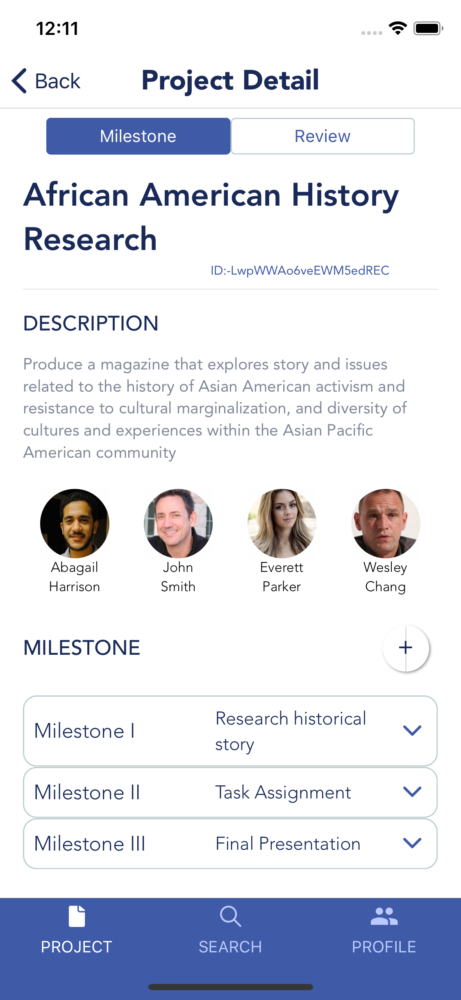
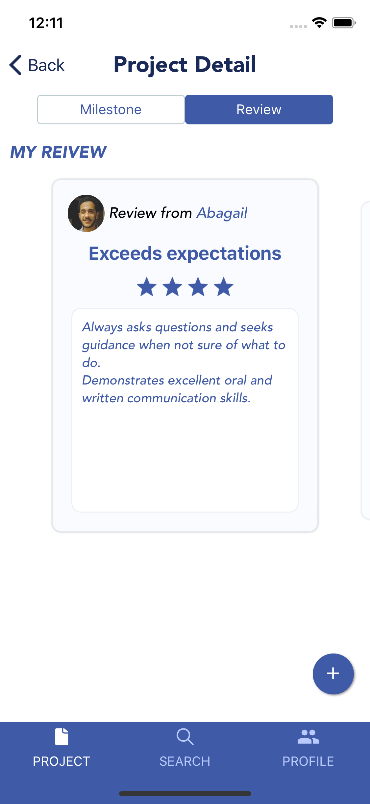
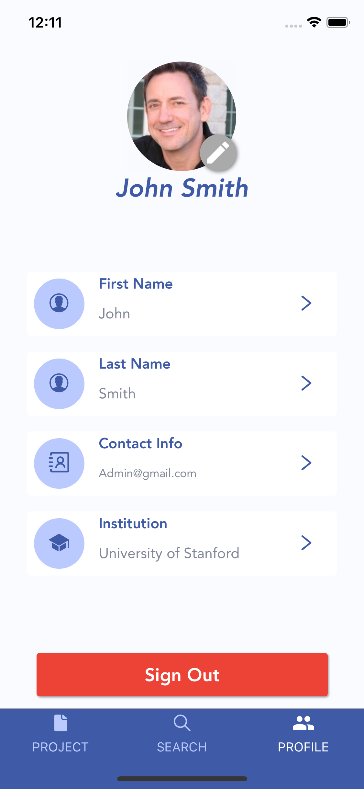

# Scope-Mobile
# Student's Project Performance Tracking Tool

## Table of Contents

#### I Project Overview
#### II Adobe XD Design
#### III System Requirement
#### IV Major Features
#### V Credit

## I Project Overview

The project Scope is a mobile application that can be used by instructor or school to provide student’s performance review based on sets of project requirements.

#### Problem or Opportunity

The majority of the student's project assessment is relying on the instructor. In a real industry, it is common practice to evaluate a team member's work with a performance review to identify strengths, weaknesses, and establish goals for the future. The absence of a student's project evaluation system limits the growth and opportunities for the students.

#### Solution

The Scope will provide a mobile application platform that can be used by schools, instructors, or students to evaluate team members' performance and utilize historical review data for the future. The Scope shall bring a new opportunity for improvement and growth among students and instructors.

## II Adobe XD Design

Adobe XD Design may vary from actual mobile application due to:
- Implementation
- Future Features

## III System Requirement   

## IV Major Features

  
   
  

  
   
 

  

## Credit

The idea of Scope originates from the SJSU-CS157A group project if you are looking for more details of the project performance management system. Check out the following  https://github.com/SJSU-Fall2019/CS157A_Team10.