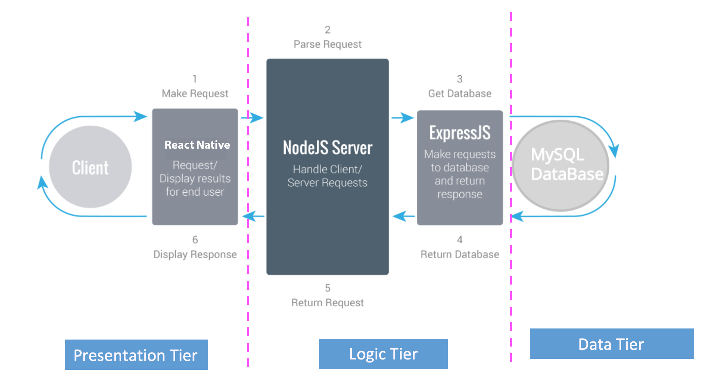

# Scope-Mobile
# Student's Project Performance Tracking Tool

## Table of Contents

#### I Project Overview
#### II Adobe XD Design
#### III System Requirement
#### IV Major Features
#### V Credit

## I Project Overview

The project Scope is a mobile application that can be used by instructor or school to provide student’s performance review based on sets of project requirements.

#### Problem or Opportunity

Today, the majority of the institution has a great teaching evaluation system to recognize a teacher's performance. The system provides accurate data and valuable feedback for the instructor to improve classroom effectiveness. However, at this moment, the majority of the student's project assessment is relying on the instructor. In a real industry, it is common practice to evaluate a team member's work with a performance review to identify strengths, weaknesses, and establish goals for the future. The absence of a student's project evaluation system limits the growth and opportunities for the students.

#### Solution

The Scope will provide a mobile application platform that can be used by schools, instructors, or students to evaluate team members' performance and utilize historical review data for the future. The Scope shall bring a new opportunity for improvement and growth among students and instructors.

## II Adobe XD Design

Adobe XD Design may vary from actual mobile application due to:
- Implementation
- Future Features

## III System Requirement   

## IV Major Features